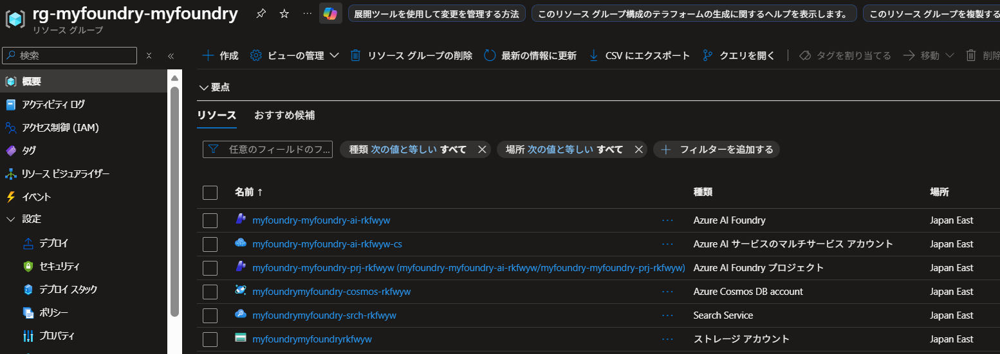
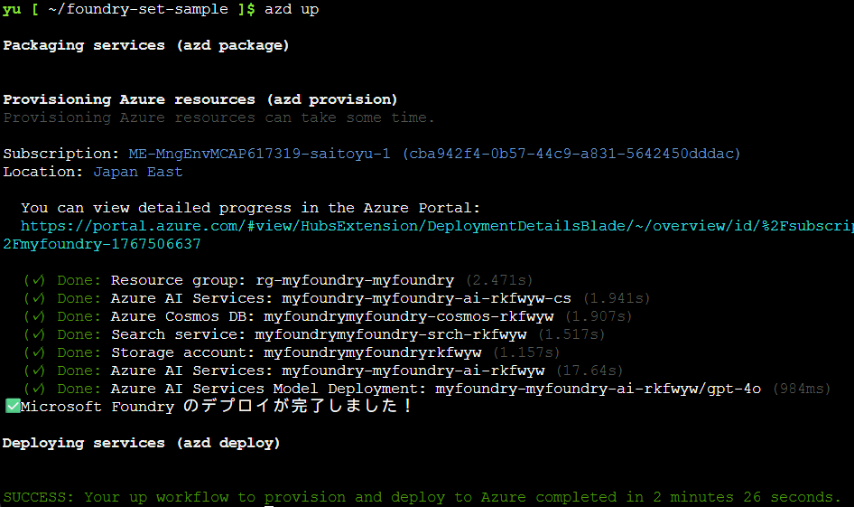
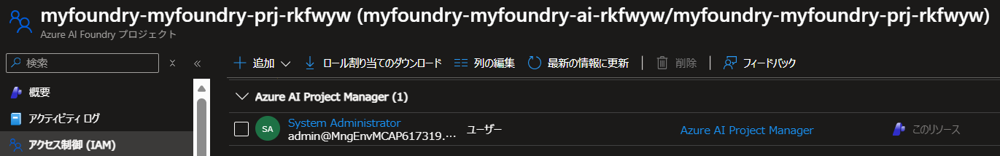

# Microsoft Foundry - Standard Setup

このプロジェクトは、Microsoft Foundry とその依存リソースを一括デプロイするための Bicep テンプレートです。

## 📋 目的と概要

このプロジェクトを使用すると、以下のリソースが自動的にデプロイされます：

### デプロイされるリソース

| リソース | 目的 | 説明 |
|---------|------|------|
| **AI Services Account** | AIモデルホスティング | Azure OpenAI (gpt-4o) などのAIモデルを提供 |
| **Cognitive Services** | マルチサービスAI | Decision、Language、Speech、Vision、Applied AIを統合した単一リソース |
| **AI Project** | プロジェクト管理 | AI Agent の開発・管理プロジェクト |
| **AI Search** | ベクトル検索 | RAG（検索拡張生成）のためのベクトル検索サービス |
| **Storage Account** | データ保存 | Blob ストレージによるデータ永続化 |
| **Cosmos DB** | ドキュメントDB | NoSQL データベース（会話履歴、メタデータ等） |

#### Azure ポータルでのリソース一覧



### 自動設定される機能

✅ **マネージドIDによる認証**: パスワード不要のセキュアな認証  
✅ **自動ロール割り当て**: AI Projectが各リソースにアクセスできるよう、必要なRBACロールを自動付与  
✅ **Agent Service設定**: AI Agentの実行環境を自動構成  
✅ **リソース接続**: AI Project と依存リソース間の接続を自動作成

### 🔐 ロール構成の全体像（最小権限の原則）

すべてのロール割り当ては**リソース単位のスコープ**で付与され、最小権限の原則に従っています。

#### AI Project（マネージドID）のロール

| リソース | ロール | スコープ | 目的 |
|---------|-------|---------|------|
| **Storage Account** | Storage Blob Data Owner | リソース単位 | Blob の完全アクセス（Agent 実行時のデータ操作） |
| **AI Search** | Search Index Data Contributor | リソース単位 | インデックスへの書き込み（RAG用） |
| **AI Search** | Search Service Contributor | リソース単位 | 検索サービスの管理 |
| **Cosmos DB** | Cosmos DB Account Reader Role | リソース単位 | アカウント情報の読み取り |
| **Cosmos DB** | Cosmos DB Built-in Data Contributor | データベース単位 | ドキュメントの読み書き（会話履歴） |

#### AI Search（マネージドID）のロール

| リソース | ロール | スコープ | 目的 |
|---------|-------|---------|------|
| **Storage Account** | Storage Blob Data Reader | リソース単位 | Blob コンテナの読み取り（ナレッジソースのインデックス作成） |

#### グループメンバーのロール（USER_PRINCIPAL_IDで指定したグループに所属するユーザー）

| リソース | ロール | スコープ | 目的 |
|---------|-------|---------|------|
| **リソースグループ** | Reader | リソースグループ単位 | リソースグループ内の全リソースの閲覧権限 |
| **AI Services Account** | Contributor | アカウント単位 | AI Services Account と配下の全 AI Project の完全な管理権限 |
| **AI Services Account** | AI Project Manager | アカウント単位 | アカウント内の全プロジェクトの管理・新規プロジェクト作成 |
| **AI Services Account** | Cognitive Services OpenAI Contributor | アカウント単位 | Azure OpenAI操作・データ生成ジョブの実行 |
| **Cognitive Services** | Contributor | リソース単位 | Cognitive Services マルチサービスアカウントの完全な管理権限 |
| **Storage Account** | Contributor | リソース単位 | Storage Account の完全な管理権限 |
| **Storage Account** | Storage Blob Data Contributor | リソース単位 | ファイルのアップロード・ナレッジソース設定 |
| **Storage Account** | Storage Account Contributor | リソース単位 | ストレージアカウント情報の読み取り |
| **AI Search** | Contributor | リソース単位 | AI Search の完全な管理権限 |
| **Cosmos DB** | Contributor | リソース単位 | Cosmos DB の完全な管理権限 |

> **セキュリティノート**: 
> - AI Services Account に Contributor ロールを付与することで、配下の全 AI Project も自動的に管理可能になります（階層的な権限継承）
> - リソースグループスコープではなく、各リソース単位でロールを付与することで、最小権限の原則に従っています
> - すべてのリソース（AI Services Account、Cognitive Services、Storage Account、AI Search、Cosmos DB）に対して個別に Contributor ロールが付与されます

---

## 🎯 デプロイ前の準備

### 1. 前提条件

- [Azure Developer CLI (azd)](https://learn.microsoft.com/azure/developer/azure-developer-cli/install-azd) がインストールされていること
- Azure サブスクリプションへのアクセス権
- リソースをデプロイするための適切な権限：
  - **Contributor** (リソース作成用)
  - **Role Based Access Control Administrator** (ロール割り当て用)

### 2. セキュリティグループIDの取得（重要）

AI Project Manager ロールをグループに付与するため、Microsoft Entra ID セキュリティグループのオブジェクトIDを取得します：

```bash
# Azure にログイン
az login

# グループのオブジェクトIDを取得（グループ名で検索）
az ad group show --group "AI Engineers" --query id -o tsv

# または、グループ一覧から探す
az ad group list --query "[?displayName=='AI Engineers'].{Name:displayName, ObjectId:id}" -o table
```

このIDをメモしておいてください（後で使用します）。

> **グループベース管理のメリット**：
> - グループに追加されたメンバーは自動的に権限を取得
> - グループから削除されたメンバーは自動的に権限を失う
> - 個別のユーザーごとにロール割り当てを管理する必要がない

---

## 🚀 デプロイ手順

### ステップ1: パラメータの設定

#### 方法A: 環境変数で設定（推奨）

```bash
# Azure Developer CLI にログイン
azd auth login

# 環境の初期化
azd init

# 必須パラメータの設定
azd env set AZURE_LOCATION japaneast          # デプロイリージョン
azd env set USER_PRINCIPAL_ID <GROUP_OBJECT_ID>  # 上記で取得したグループのオブジェクトID

# オプション: カスタマイズしたい場合
azd env set MODEL_CAPACITY 200                # モデルキャパシティ（デフォルト: 100）
azd env set PROJECT_DISPLAY_NAME "My AI Project"  # プロジェクト表示名
```

> **注意**: `azd init`で指定する環境名（例: `foundry-demo`）が、すべてのリソース名のベースになります。リソースグループは`rg-{環境名}`、各リソースは`{環境名}-{リソースタイプ}-{ハッシュ}`の形式で作成されます。

#### タグの設定（オプション）

リソースグループおよび全リソースに対してカスタムタグを設定する場合：

```bash
# デフォルトタグ（設定済み）:
# - environment: {azd環境名}
# - managedBy: azd
# - project: azure-ai-foundry

# カスタムタグを追加する場合（JSON形式）
azd env set TAGS '{
  "environment": "production",
  "managedBy": "azd", 
  "project": "azure-ai-foundry",
  "costCenter": "12345",
  "owner": "myteam",
  "department": "engineering"
}'
```

> **注意**: JSON形式で指定する際は、既存のデフォルトタグも含めて完全なオブジェクトとして記述してください。

#### 方法B: infra/main.parameters.json で設定

`infra/main.parameters.json` を直接編集：

```json
{
  "parameters": {
    "userPrincipalId": {
      "value": "xxxxxxxx-xxxx-xxxx-xxxx-xxxxxxxxxxxx"  // グループのオブジェクトID
    },
    "modelCapacity": {
      "value": 200
    },
    "tags": {
      "value": {
        "environment": "production",
        "managedBy": "azd",
        "project": "azure-ai-foundry",
        "costCenter": "12345",
        "owner": "myteam",
        "department": "engineering"
      }
    }
  }
}
```

### ステップ2: デプロイ実行

```bash
# 一括デプロイ（対話式）
azd up
```

`azd up` を実行すると、以下を対話的に入力します：
- **環境名**: 例: `dev`, `test`, `prod`
- **Azure サブスクリプション**: デプロイ先のサブスクリプション選択

リソースグループは自動的に作成されます（命名: `rg-{環境名}-{baseName}`）

#### 実行結果



### ステップ3: デプロイ確認

```bash
# デプロイされたリソースの情報を表示
azd show

# 環境変数と出力値を表示
azd env get-values

# AI Project のエンドポイントを確認
azd env get-values | grep aiAccountEndpoint
```

---

## ⚙️ パラメータ詳細

### 必須パラメータ

| パラメータ | 設定方法 | 説明 | 例 |
|-----------|---------|------|---|
| `AZURE_LOCATION` | 環境変数 | デプロイリージョン | `japaneast`, `eastus` |
| `USER_PRINCIPAL_ID` | 環境変数 or JSON | セキュリティグループのオブジェクトID（AI Project Manager ロール付与対象） | `12345678-1234-...` |

### オプションパラメータ（カスタマイズ可能）

| パラメータ | デフォルト値 | 説明 | 設定場所 |
|-----------|------------|------|---------|
| `modelName` | `gpt-4o` | デプロイするAIモデル | `infra/main.parameters.json` |
| `modelVersion` | `2024-08-06` | モデルバージョン | `infra/main.parameters.json` |
| `modelCapacity` | `100` | モデルのTPM（1分あたりのトークン数）容量 | `infra/main.parameters.json` |
| `projectDisplayName` | `AI Agent Project` | プロジェクトの表示名 | `infra/main.parameters.json` |
| `projectDescription` | - | プロジェクトの説明 | `infra/main.parameters.json` |

### 既存リソースの使用（オプション）

既存のAI Search、Storage、Cosmos DBを使用する場合：

```json
{
  "parameters": {
    "existingAiSearchResourceId": {
      "value": "/subscriptions/{sub-id}/resourceGroups/{rg}/providers/Microsoft.Search/searchServices/{name}"
    },
    "existingStorageAccountResourceId": {
      "value": "/subscriptions/{sub-id}/resourceGroups/{rg}/providers/Microsoft.Storage/storageAccounts/{name}"
    },
    "existingCosmosDbAccountResourceId": {
      "value": "/subscriptions/{sub-id}/resourceGroups/{rg}/providers/Microsoft.DocumentDB/databaseAccounts/{name}"
    }
  }
}
```

---

## 🔐 ロールの割り当て

### AI ProjectのマネージドIDに自動付与されるロール

AI Projectのシステム割り当てマネージドIDに対して、以下のロールが自動的に付与されます：

#### AI Search
- **Search Index Data Contributor**: インデックスの読み書き権限
- **Search Service Contributor**: サービス管理権限

#### Cosmos DB
- **Cosmos DB Account Reader Role**: アカウント情報の読み取り
- **Cosmos DB Built-in Data Contributor**: データの読み書き権限

#### Storage Account
- **Storage Account Contributor**: アカウント管理権限
- **Storage Blob Data Contributor**: Blobデータの読み書き権限

### グループメンバーに付与されるロール

`userPrincipalId` で指定したセキュリティグループに所属するすべてのメンバーに対して：

- **Reader (リソースグループ)**: リソースグループ内の全リソースの閲覧権限
- **Contributor (全リソース)**: すべてのAzureリソース(AI Services Account、AI Project、Cognitive Services、Storage Account、AI Search、Cosmos DB)の完全な管理権限
- **AI Project Manager**: AI Projectの完全な管理権限(リソース作成・更新・削除、設定変更など)
- **Cognitive Services OpenAI Contributor**: Azure OpenAI操作・データ生成ジョブの実行
- **Storage Blob Data Contributor**: ファイルのアップロード・ナレッジソース設定
- **Storage Account Contributor**: ストレージアカウント情報の読み取り

**重要**: `userPrincipalId` を指定しない場合、Azure Portal からAI Projectにアクセスできない可能性があります。グループに所属するメンバーは、グループから削除されると自動的に権限を失い、追加されると自動的に権限を取得します。

#### 付与された AI Project Manager ロールの確認



---

## 📁 プロジェクト構造

```
.
├── azure.yaml                              # Azure Developer CLI 設定
├── infra/                                  # インフラストラクチャコード
│   ├── main.bicep                          # エントリーポイント（サブスクリプションスコープ）
│   ├── main.resources.bicep                # リソースデプロイメント
│   ├── main.parameters.json                # パラメータ設定ファイル ★重要★
│   └── modules/                            # モジュール
│       ├── core/                           # AI Account & Project
│       ├── dependent-resources/            # AI Search, Storage, Cosmos DB
│       ├── security/                       # ロール割り当て
│       ├── capabilities/                   # Agent Service設定
│       └── utils/                          # ユーティリティ
├── README.md                               # このファイル
└── DEPLOYMENT-GUIDE.md                     # 詳細デプロイガイド
```

---

## 🔄 更新とリソースの管理

### パラメータの変更

```bash
# モデルキャパシティを変更
azd env set MODEL_CAPACITY 200

# 再デプロイ
azd up
```

### 複数環境の管理

```bash
# 開発環境
azd env new dev
azd env set USER_PRINCIPAL_ID <YOUR_ID>
azd up

# 本番環境
azd env new prod
azd env set USER_PRINCIPAL_ID <YOUR_ID>
azd env set MODEL_CAPACITY 500
azd up

# 環境の切り替え
azd env select dev
```

---

## 🧹 クリーンアップ

```bash
# すべてのリソースを削除（リソースグループも含む）
azd down

# プロンプトなしで削除
azd down --force --purge
```

---

## 📝 よくある質問（FAQ）

### Q1: userPrincipalId は必須ですか？

**A**: いいえ、省略可能ですが、**強く推奨**します。指定しない場合、Azure Portal から AI Project にアクセスして管理操作を行うことができません。Agent の実行自体は可能ですが、プロジェクトの設定変更やリソース管理ができなくなります。

### Q2: グループのオブジェクトIDはどこで確認できますか？

**A**: 以下のコマンドで取得できます：
```bash
# グループ名で検索
az ad group show --group "AI Engineers" --query id -o tsv

# またはグループ一覧から探す
az ad group list --query "[?displayName=='AI Engineers'].{Name:displayName, ObjectId:id}" -o table
```

または、Azure Portal > Microsoft Entra ID > グループ > 対象グループ > オブジェクトID

### Q2.1: 個別のユーザーに権限を付与したい場合は？

**A**: グループを使用せず個別ユーザーに付与する場合は、Bicep ファイルで `principalType: 'Group'` を `principalType: 'User'` に変更してください。ただし、グループベースの管理が推奨されます（メンバーシップの変更だけで権限制御が可能）。

### Q3: 既存のAI Search/Storage/Cosmos DB を使いたい

**A**: `infra/main.parameters.json` で対応するリソースIDを指定してください：
```json
{
  "parameters": {
    "existingAiSearchResourceId": {
      "value": "/subscriptions/.../searchServices/my-search"
    }
  }
}
```

### Q4: デプロイに失敗した場合は？

**A**: 以下を確認してください：
1. 必要な権限（Contributor + RBAC Administrator）があるか
2. リージョンでAzure OpenAIが利用可能か
3. サブスクリプションのクォータが十分か

詳細なエラーログは `azd deploy --debug` で確認できます。

### Q5: 料金はどのくらいかかりますか？

**A**: 主なコスト要因：
- **Azure OpenAI**: 使用量課金（トークン数による）
- **AI Search**: Basic tier（約5,000円/月〜）
- **Storage Account**: 使用量課金（数百円〜）
- **Cosmos DB**: Serverlessモード（使用量課金）

開発環境で小規模利用の場合、月額1万円程度が目安です。

---

## 📞 トラブルシューティング

### エラー: "リソース名が既に存在します"

別の環境名を使用してください：
```bash
azd env new myproject2
azd up
```

### エラー: "権限がありません"

必要なロール：
- **Contributor** - リソースの作成
- **Role Based Access Control Administrator** - ロール割り当て

サブスクリプション管理者に権限付与を依頼してください。

### エラー: "クォータ超過"

Azure Portal でクォータを確認し、必要に応じて増加をリクエストしてください。または別のリージョンを試してください。

### ログの詳細確認

```bash
# デプロイログの詳細表示
azd deploy --debug

# 環境変数の確認
azd env get-values

# デプロイ状態の確認
azd show --output json
```

---

## 🔗 関連リンク

- [Microsoft Foundry (Azure AI Foundry) ドキュメント](https://learn.microsoft.com/azure/ai-studio/)
- [Azure Bicep ドキュメント](https://learn.microsoft.com/azure/azure-resource-manager/bicep/)
- [Azure OpenAI Service](https://learn.microsoft.com/azure/cognitive-services/openai/)
- [Azure Developer CLI (azd)](https://learn.microsoft.com/azure/developer/azure-developer-cli/)

---

## 📄 ライセンス

このプロジェクトは MIT ライセンスの下で公開されています。
